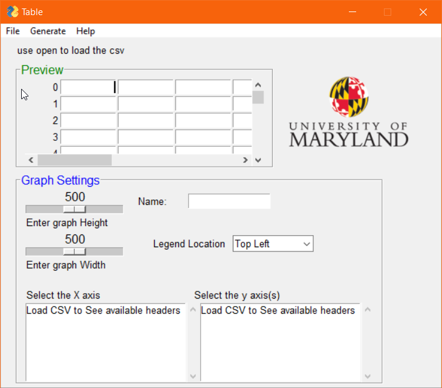

    

# CSV Data Grapher

This program generates graphs from a given CSV file and allows the user to generate a User friendly graph


## Getting Started

These instructions will get you a copy of the project up and running on your local machine for development and testing purposes. See deployment for notes on how to deploy the project on a live system.

### Prerequisites

Programs and other things needed to run this program
```
Python 3.x
Pip
```

### Installing

A step by step series of examples that tell you how to get a development env running


```
pip install tkinter
pip install pandas
pip install PySimpleGUI
pip install bokeh
```

(optional) not needed

```
import tkinter
import pandas
import PySimpleGUI
import bokeh
```

## Running the tests

To ensure that all modules are loaded and everything is working. Launch the program and attempt to load a CVS into the program, If the data from the CVS is displayed then Graph Generator is working

Check the screenshots for examples of what the program is supposed to look like

## Deployment

The best way to deploy this software for use in lab is to run locally either through command prompt or a Python Interpreter of your own
## Built With

* [Pandas](https://pandas.pydata.org/) - Used to edit and read CSV's
* [PySimpleGUI](https://pypi.org/project/PySimpleGUI/) - Used to create a GUI more efficiently
* [TKinter](https://docs.python.org/3/library/tkinter.html) - Used as backend GUI framework and support
* [Bokeh](https://bokeh.pydata.org/en/latest/) - Used as plotting software for the plot function

## Contributing

If any Enhancements, Features or Problems arrise, Please submit a request on github

## Versioning

No versioning control has been set up yet but I am working on having this work in the Future 

## Authors

* **Jonathan Obenland** - *Initial work* - [Jonathan Obenland](https://github.com/jobenland)

## License

This project is licensed under the GPL License

## ScreenShots



